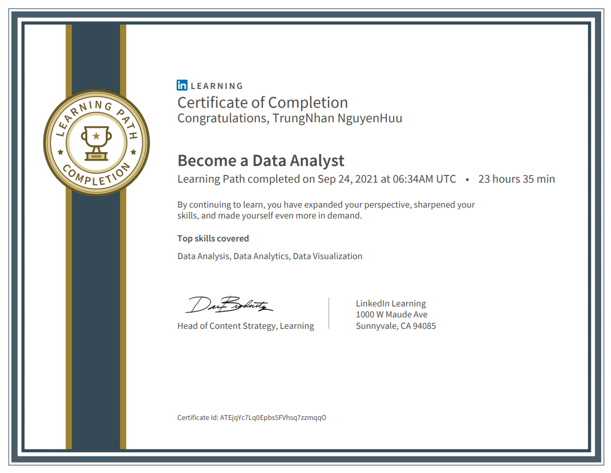

# become-a-data-analyst
I learned the fundamental knowledge of a Data Analyst
 
 

 
 
## My journey to be awarded the above certificate
[1. Learning Data Analytics](https://github.com/TrungNhanNguyenHuu/DataAnalytics01)
 
 
[2. Data Fluency: Exploring and Describing Data](https://github.com/TrungNhanNguyenHuu/DataAnalytics02)
 
 
[3. Excel Statistics Essential Training: 1](https://github.com/TrungNhanNguyenHuu/data-analytics-03)
 
 
[4. Learning Excel: Data Analysis](https://github.com/TrungNhanNguyenHuu/data-analytics-04)
 
 
[5. Learning Data Visualization](https://github.com/TrungNhanNguyenHuu/data-analytics-05)
 
 
[6. Power BI Essential Training](https://github.com/TrungNhanNguyenHuu/data-analytics-06)
 
 
[7. Tableau Essential Training (2020.1)](https://github.com/TrungNhanNguyenHuu/data-analytics-07)
